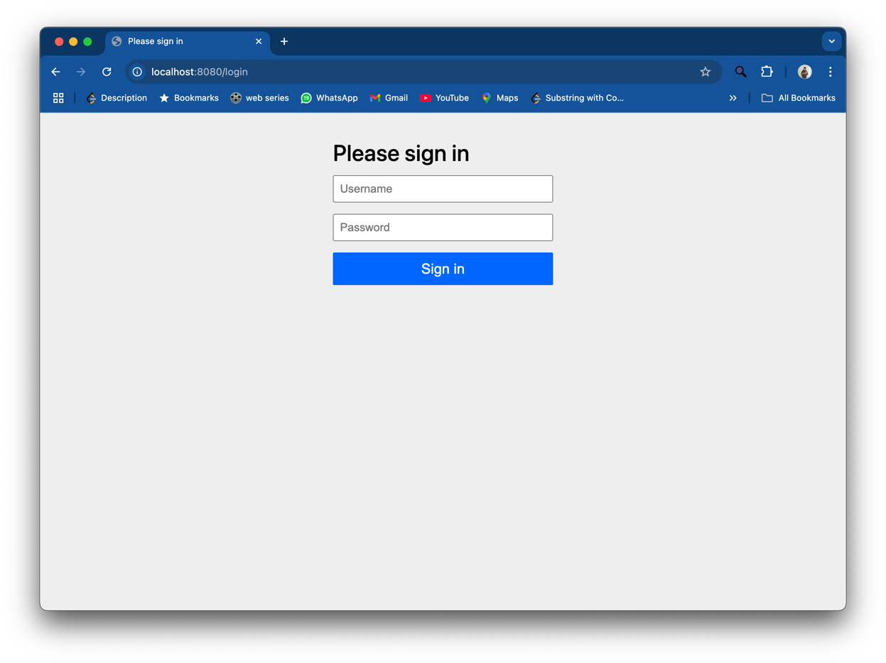
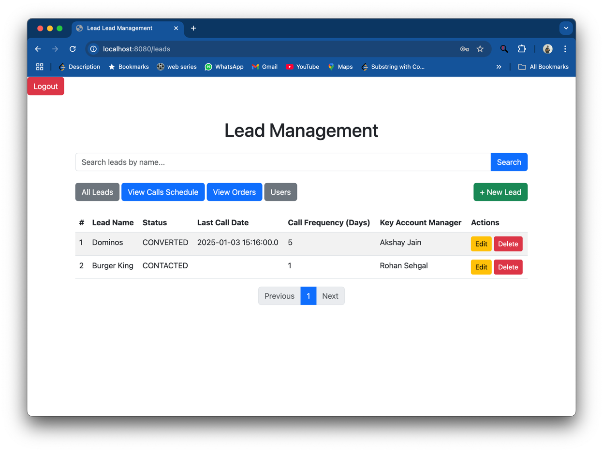
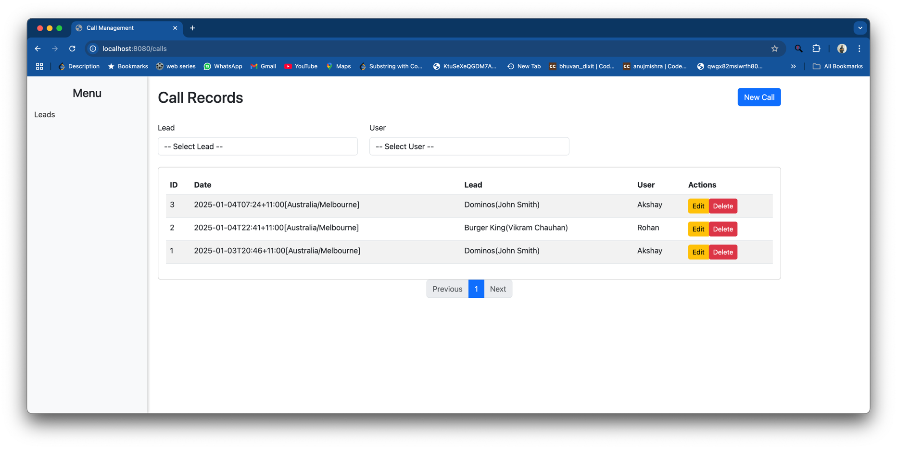
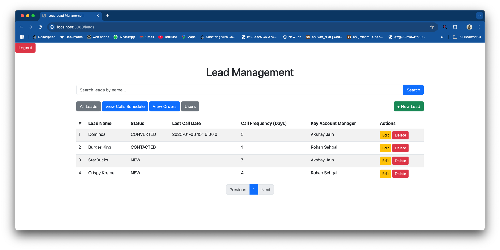
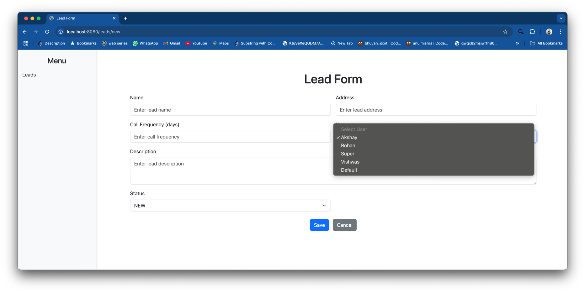
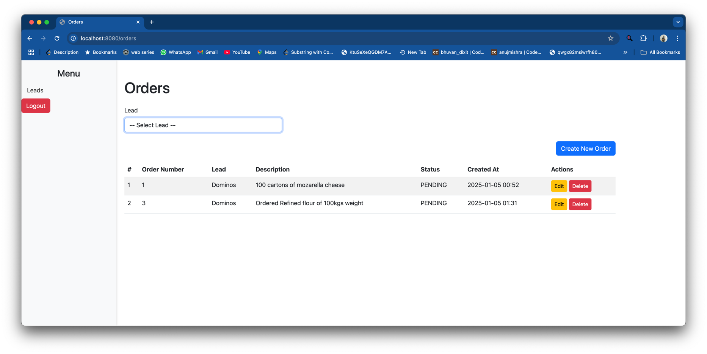
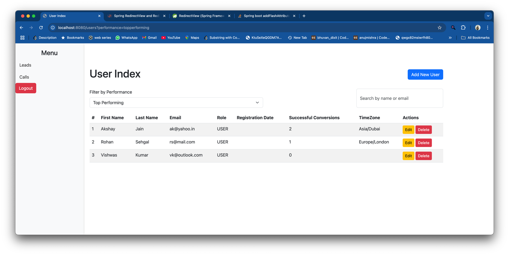

# Lead Management System

## Project Overview

The Lead Management System (LMS) is a web application designed to manage leads, orders, calls, users, and contacts in a sales environment. It allows users to create, view, and manage orders, leads, and associated contacts, while administrators can manage user roles and permissions.

This system provides features for filtering, sorting, and paginating through leads and orders, as well as editing and deleting records. It also supports adding and updating user roles, with different levels of access depending on the user role (e.g., Admin, User).

The system is built with the Spring Framework and includes features such as:
- Managing leads and their associated contacts.
- Handling orders tied to leads.
- Tracking calls and creating new records.
- User management with role-based access.
- Data validation and error handling.
- Form-based interactions for creating and updating leads, orders, and users.

## System Requirements

To run this project, you will need the following system requirements:

- **Java**: Version 11 or later.
- **Maven**: Version 3.8 or later (for building the project).
- **Database**: MySQL or any relational database management system (RDBMS) configured with the appropriate schema.
- **Spring Boot**: Version 2.5 or later.
- **JDK**: Java Development Kit version 11 or later.
- **IDE**: An Integrated Development Environment (IDE) such as IntelliJ IDEA or Eclipse for Java development.

### Dependencies:
- **Spring Boot**: For the backend framework.
- **Spring Data JPA**: For ORM and database operations.
- **Thymeleaf**: For rendering HTML views.
- **MySQL**: For data storage.
- **Maven**: For dependency management and building the application.

### Additional Tools:
- **Git**: For version control.
- **Docker** (optional): To containerize the application for easier deployment.

Make sure to have the system requirements set up before you run the project. You can find more information on the necessary dependencies in the `pom.xml` file in the root of the project.


## Installation Instructions

Follow the steps below to set up and run the Lead Management System (LMS) locally.

### 1. Clone the Repository
Start by cloning the repository to your local machine:

```bash
git clone https://github.com/your-username/lead-management-system.git
```
### 2. Navigate to the project
```bash
cd lead-management-system
```

### 3. Setup DataBase

```bash
mysql -u root -p
CREATE DATABASE lead_management_system;
```

### 4. Configure Application Properties
Configure the database settings in src/main/resources/application.properties. Set the database username, password, and URL according to your MySQL setup.

### 5. Build and Run the Application

## Running instructions

There is a script which runs on start of the server to create the default admin user
to change the email and password please refer to that script present in 
``` bash
src/main/java/com/example/lead/management/system/components/DefaultAdminUserInitializer.java
```

on start of the application login with those credentials defined in the script.

## Test Execution
If you are using an Integrated Development Environment (IDE) like IntelliJ IDEA or Eclipse, you can:

Right-click the test class (e.g., UserControllerTest).
Select "Run" or "Run with JUnit" to execute the tests.
## API Documentation

### Calls

- **GET /calls**  
  Retrieves all call records for the currently logged-in user, with optional filtering by lead and user. Supports pagination.

- **GET /calls/new**  
  Displays a form to create a new call.

- **GET /calls/{id}/edit**  
  Displays a form to edit an existing call based on its ID.

- **POST /calls/save**  
  Saves a new call with the logged-in user as the creator.

- **POST /calls/{id}/update**  
  Updates an existing call based on its ID.

---

### Leads and Contacts

- **GET /leads/{leadId}/contacts/new**  
  Displays a form to create a new contact for the specified lead.

- **POST /leads/{leadId}/contacts/save**  
  Saves a new contact for the specified lead.

- **GET /leads/{leadId}/contacts**  
  Retrieves all contacts associated with the specified lead.

- **GET /leads/{leadId}/contacts/{id}/edit**  
  Displays a form to edit an existing contact for the specified lead and contact ID.

- **GET /leads/{leadId}/contacts/{id}/delete**  
  Deletes the specified contact for the given lead and redirects to the contacts list.

- **POST /leads/{leadId}/contacts/{id}/update**  
  Updates an existing contact with the given ID and associated lead.

---

### Leads

- **GET /leads/new**  
  Displays a form to create a new lead, including options for users, statuses, countries, and the current user.

- **POST /leads/save**  
  Saves a new lead based on the provided `LeadDto` data.

- **GET /leads**  
  Retrieves a paginated list of leads for the current user, optionally filtered by a search query.

- **GET /leads/{id}/edit**  
  Displays a form to edit an existing lead with the specified ID.

- **POST /leads/{id}/update**  
  Updates an existing lead with the given ID using the provided `LeadDto` data.

- **GET /leads/{id}/delete**  
  Deletes the lead with the specified ID.

---

### Orders

- **GET /orders/new**  
  Displays the form for creating a new order, with options for selecting leads and statuses.

- **POST /orders/save**  
  Saves a new order based on the provided `OrderDto` and re-displays the form with the order data.

- **GET /orders**  
  Retrieves a paginated list of orders for the current user or all orders if the user is an admin. Optionally filters orders by lead ID and sorts them by creation date.

- **GET /orders/{id}/edit**  
  Displays the form to edit an existing order with the specified ID.

- **POST /orders/{id}/update**  
  Updates the specified order with the provided `OrderDto` data.

- **POST /orders/{id}/delete**  
  Deletes the specified order and redirects back to the orders list.

---

### Users

- **GET /users/add-user**  
  Displays the form for adding a new user, with options for selecting time zones and roles.

- **GET /users/{id}/edit**  
  Displays the form for editing an existing user with the specified ID. If the user is not found, the user is redirected to the users list with an error message.

- **POST /users/{id}/update**  
  Updates an existing user based on the provided `UserDto`. If the user is not found, an error message is shown.

- **POST /users/save**  
  Saves a new user, setting the default role to "USER" and the join date to the current time. If there are any validation errors, it returns a `BAD_REQUEST` response with an error message.

- **GET /users**  
  Lists all users, with an optional filter based on performance (`topperforming` or `lowestperforming`). It maps the user data to `UserDto` and provides a filter indicator in the model.


## Sample Usage Examples







